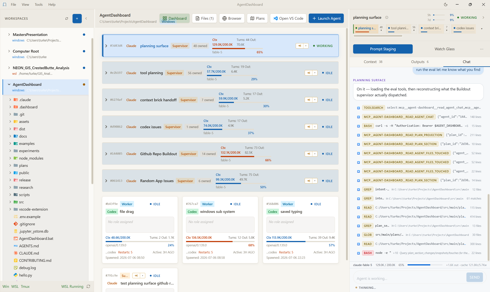
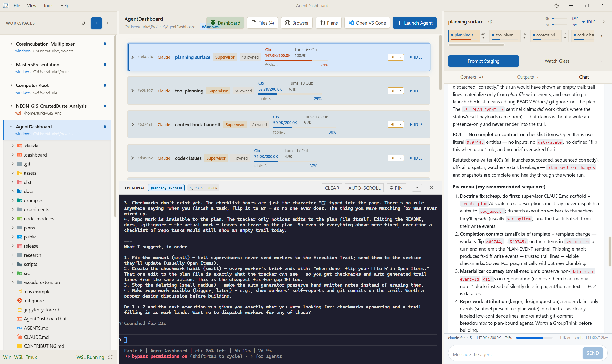
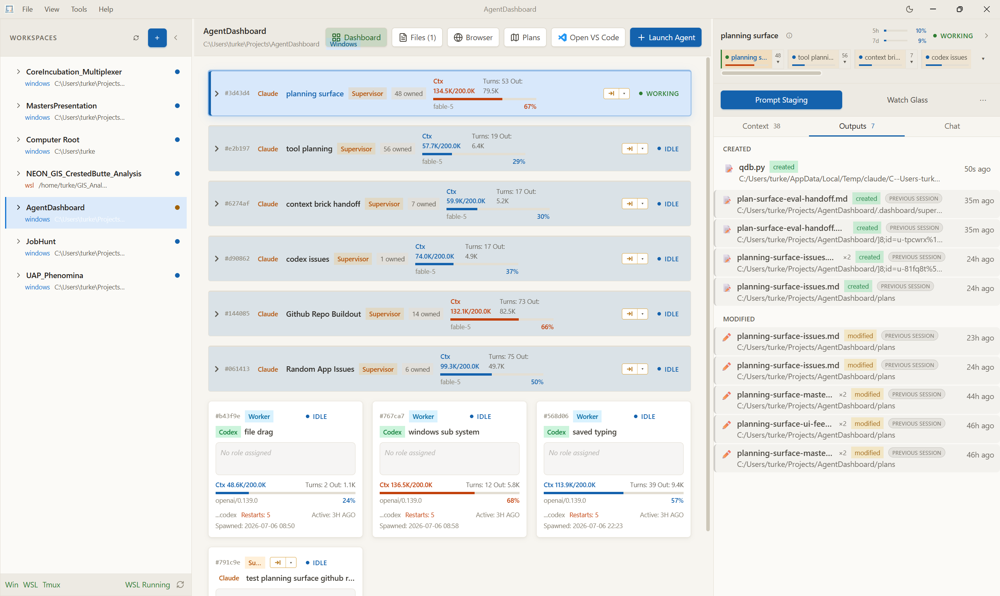
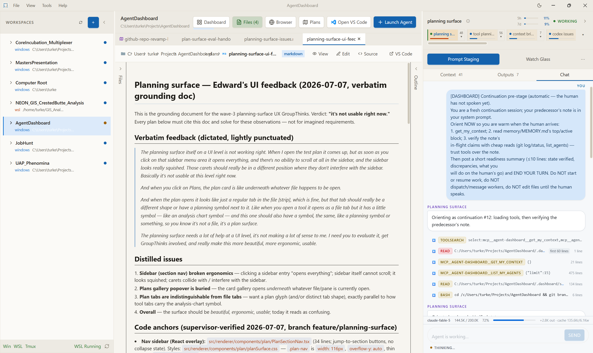
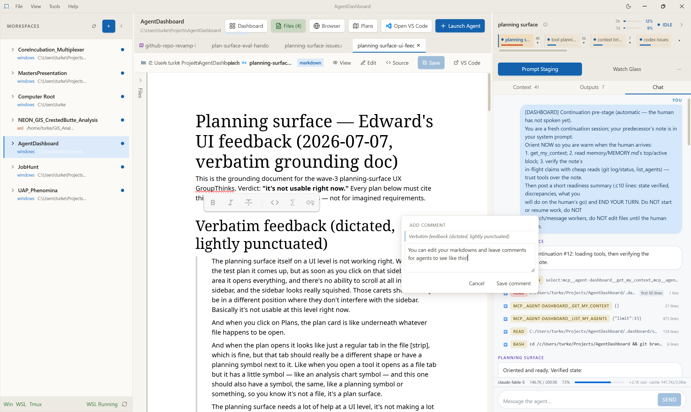
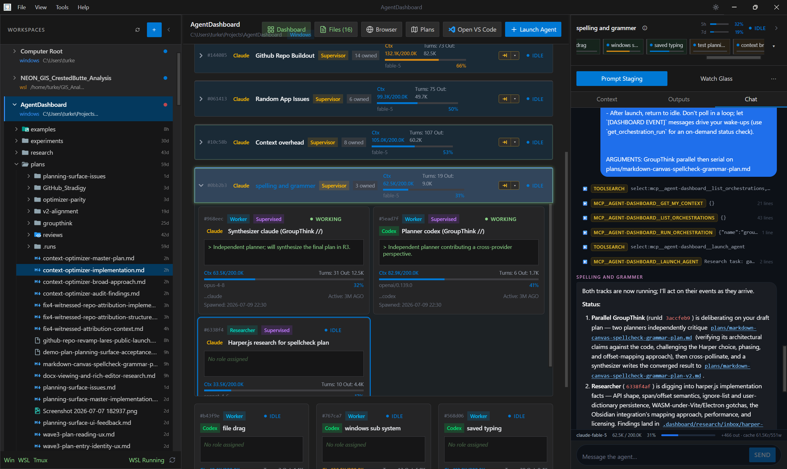
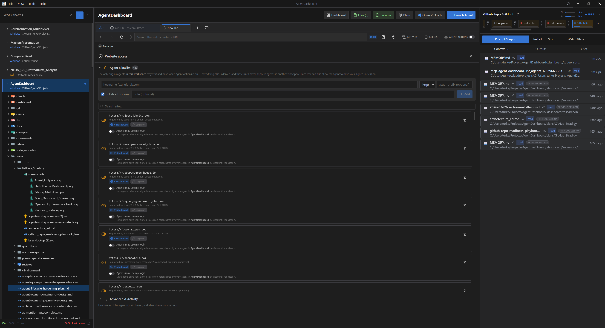

<p align="center">
  
</p>

<p align="center">
  
</p>

<h1 align="center">Lares</h1>

<p align="center"><strong>Watch, direct, and collaborate with teams of AI agents — in one workspace.</strong></p>

<p align="center">An agent-native workspace for orchestrating AI agents across terminals, files, browsers, documents, and notebooks.</p>

<p align="center"><strong>Built on terminal-agent harnesses, not provider SDKs</strong> — drop in Claude Code, Codex,<br />or any agent that speaks MCP and hooks, and put them on the same problem together.</p>

<p align="center">
  
</p>

---

## Status


> **⚠ Alpha — agents execute real commands.** Lares runs AI agents that execute
> commands in real terminals, drive a real browser (including authenticated
> sessions), and read/write files in your workspace. Treat every agent as
> capable of running arbitrary code and of sending data over the network. Use it
> only in workspaces you trust; use throwaway credentials and keep long-lived
> secrets out of active workspaces; avoid signing into sensitive accounts in the
> Lares browser during alpha runs; and prefer a sandboxed or disposable
> environment. Security boundaries are experimental and incomplete — see
> [SECURITY.md](SECURITY.md).

## What & why

**Lares is built on terminal-agent harnesses, not provider SDKs.** Agents run as
real CLIs in real terminals, so any harness that speaks MCP and can fire hooks
drops straight in — no vendor SDK, no integration to wait on, no lock-in. That
neutrality is the point: it's what lets Claude Code and Codex work the same
problem and converge on a shared answer, which has turned out to be the most
powerful thing the app does.

It exists because of three frustrations:

- **My agents kept getting lost.** They were scattered across too many terminals
  in too many VS Code windows, and finding the one that needed me meant hunting
  through all of them. Every agent should be on one rail, status visible at a
  glance.
- **I wanted Claude Code and Codex to talk to each other.** I liked working with
  both, and there was no way to put them on the same problem together.
- **Agents stalled.** They asked too many questions and paused too often, and
  more often than not they already knew the right next step and simply didn't
  take it. So Lares has a supervisor whose job is to orchestrate agents and keep
  them working — one that knows what's left in an agent's context window and
  where you are against your usage limits.

The thesis is visibility-first: agents are never headless and never a black box.
Agents can still spawn their own native task subagents, and those stay internal
to the harness — what's different is the top level. The supervisor launches and
monitors **full agent harnesses from more than one provider**, reads their chat
logs, and messages them directly. You watch each agent's live status and context
budget, attach to its chat, inspect the tool calls it makes and the files it
reads versus writes, and step in at any point.

Code is one tool among many. The same workspace edits Markdown in a real editor
(Milkdown) with native spellcheck, takes comments anchored to a selection in
documents and PDFs, browses the web, and views PDFs, images, and CSVs inline —
so drafting a document is something you do here rather than somewhere else.
Non-code work is a first-class citizen, not an afterthought.

## Core features

- **Observe** — Live agent cards show each agent's name, status, and context-%
  in real time. Attach an agent's chat to read its transcript, scrub its tool
  calls, see files-read-vs-written, and leave inline comments on what it touched.
- **Orchestrate** — Real terminals (node-pty + xterm, with a WSL/tmux bridge)
  host the agents. A supervisor dispatches worker and researcher waves, and
  two providers can run a cross-provider **groupthink** deliberation
  (Claude ↔ Codex) that converges on a shared answer.
- **Plan** — An HTML planning surface captures structured plans with a
  server-witnessed provenance trail of which agent actually read and edited each
  section.
- **Browse** — Agents navigate real web pages in an embedded browser, and Lares
  closes their tabs once they're finished with them. You control exactly which
  sites an agent may visit, and can optionally hand it your signed-in session for
  a site you choose. An action audit log keeps a record of what they did.
- **Documents & notebooks** — Jupyter notebooks run with live outputs; Markdown
  documents (Milkdown/Crepe) carry agent-visible comments, and Word, PDF, and
  figure/GIS formats (GeoTIFF, Leaflet, KaTeX) render inline.
- **Context & usage intelligence** — Lares is context-aware. A supervisor nearing
  its context window hands off automatically: it writes a continuation note and
  relaunches into a fresh session with its work intact. Supervisors are notified
  when a worker's context runs hot, and can see where you stand against your
  subscription's usage limits (5-hour and 7-day windows). Built-in telemetry
  surfaces where context and tokens go — flagging MCP toolsets that were granted
  but never used, and dead guidance lines worth cutting from `CLAUDE.md`.

<table>
<tr>
<td width="50%" valign="top">
<a href="docs/images/terminal-attach.png"></a>
<sub><strong>Attach a terminal.</strong> Double-click any agent card to drop into the real terminal it runs in.</sub>
</td>
<td width="50%" valign="top">
<a href="docs/images/agent-outputs.png"></a>
<sub><strong>See what it touched.</strong> The Outputs pane lists every file each agent created and modified.</sub>
</td>
</tr>
<tr>
<td width="50%" valign="top">
<a href="docs/images/planning-surface.png"></a>
<sub><strong>Plan in the open.</strong> Plans render as documents, with a provenance trail of which agent read and edited each section.</sub>
</td>
<td width="50%" valign="top">
<a href="docs/images/markdown-editing.png"></a>
<sub><strong>Comment for agents.</strong> Edit Markdown inline and leave comments your agents can read.</sub>
</td>
</tr>
</table>

## Quick start

Lares runs from source during alpha (no packaged installer yet).

<details>
<summary><strong>Prerequisites</strong></summary>

- **Node ≥ 20** and npm.
- **A terminal-agent CLI** — [Claude Code](https://claude.com/claude-code) is the
  reference harness today.
- **Windows with WSL** — the tmux-backed terminals run through a WSL bridge.
- **Native build prerequisites** — the native modules `better-sqlite3` and
  `node-pty` need the standard Windows native-build toolchain.

Native build trouble? See [docs/setup.md](docs/setup.md).

</details>

**New user — agent-assisted setup (recommended):**

```bash
git clone https://github.com/getlares/lares.git
cd lares
npm install
claude          # open Claude Code in the repo
```

Then tell Claude Code:

> Set up Lares

The bundled setup skill walks you through version checks, optional integrations,
non-secret settings, secrets (in a separate terminal — never in the AI session),
build, launch, and a health check.

**Developer setup — run it yourself:**

```bash
npm install
npm run build
npm run start
```

Then open a workspace folder from the app.

## Example workflows

See [docs/workflows.md](docs/workflows.md) for how multi-agent workflows are
structured, and [`examples/`](examples/) for three copyable workflow / prompt
examples:

- [research-report](examples/research-report/) — fan-out research into a cited report.
- [notebook-cleanup](examples/notebook-cleanup/) — repair and validate a notebook.
- [code-review](examples/code-review/) — a multi-agent review pass.

Cross-provider groupthink also ships as a real orchestration script.
[`scripts/groupthink-v1.js`](scripts/groupthink-v1.js) drives an entire two-agent
deliberation through the dashboard's local HTTP API — launching the lead and the
reviewer, relaying messages between them with framing prose, gating each turn on
the other agent being ready, and polling the run to completion. It drives a
running Lares instance rather than working standalone, and it doubles as a
reference for writing your own orchestration scripts. The same loop now also runs
in-process behind the `run_orchestration` MCP tool, which is the path new work
should take.

## Providers

As above: no provider SDK, no lock-in. Lares only needs what a terminal-agent
harness already exposes, which comes down to two things:

- **MCP** — how agents reach the workspace. The dashboard's tools (launch and
  message agents, read chats, read plans, drive the browser, query context and
  usage) are served over MCP, so a harness that speaks MCP can use them.
- **Hooks** — how the workspace sees the agent. Lares scaffolds lifecycle hooks
  (session start, prompt submit, notification, stop) that report each agent's
  status back to the dashboard. Hooks are what make an agent's state visible
  rather than guessed at.

A harness with both drops in and works. Claude Code is the reference we develop
and test against, and Codex is wired in for cross-provider groupthink; those two
are the tested surface today.

| Provider | Status |
|---|---|
| **Claude Code** | Primary, tested. |
| **Codex** | Used for cross-provider groupthink. |
| **Core** | Provider-neutral by design; any MCP + hooks harness should work. Additional harnesses welcome. |

<p align="center">
  
</p>

<p align="center"><sub>A cross-provider groupthink mid-flight — a Claude synthesizer and a Codex planner deliberating side by side (dark theme).</sub></p>

## Architecture & Security

**Architecture.** Lares is an Electron + React desktop app. The main process runs
the supervisor, agent runners, the embedded browser, the planning surface, and an
MCP tool surface; the renderer is the visibility shell. Many agents share a
working directory by design. For how the pieces fit together, see
[docs/architecture.md](docs/architecture.md).

**Security.** Lares is pre-1.0 with no security guarantees: the model is "you
trust the agents and the workspace," not "the app sandboxes the agents." Some
boundaries exist today (browser access policy + action audit, best-effort
path confinement, an untrusted-inbox convention for research); others do not yet
(terminal commands are not sandboxed or gated). Read [SECURITY.md](SECURITY.md)
before running it, and see [docs/security.md](docs/security.md) for the longer
threat model.

<p align="center">
  
</p>

<p align="center"><sub>The embedded browser's agent allowlist: the only origins agents may drive in a workspace, and whether each may use your signed-in session.</sub></p>

## Roadmap

- First-class, tested and documented support for more terminal-agent harnesses.
  Any harness with MCP and hooks should already work; Claude Code and Codex are
  simply the two we've verified.
- Packaged, signed builds and auto-update (today: install from source).
- macOS and Linux support (today: Windows + WSL).
- More worked examples and workflow templates, building on
  [`examples/`](examples/) and the scripted orchestration in
  [`scripts/groupthink-v1.js`](scripts/groupthink-v1.js) today.

## Contributing & License

Contributions are welcome — see [CONTRIBUTING.md](CONTRIBUTING.md) to get started.

Lares is licensed under **Apache-2.0** — see [LICENSE](LICENSE).

> The **Lares** were the Roman household guardians that watched over the home — a
> fitting name for a workspace whose whole thesis is that your agents are never a
> black box. The full origin and philosophy live in [docs/vision.md](docs/vision.md).
